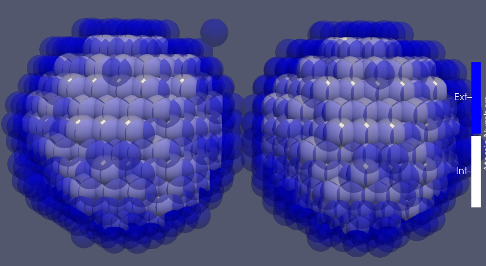
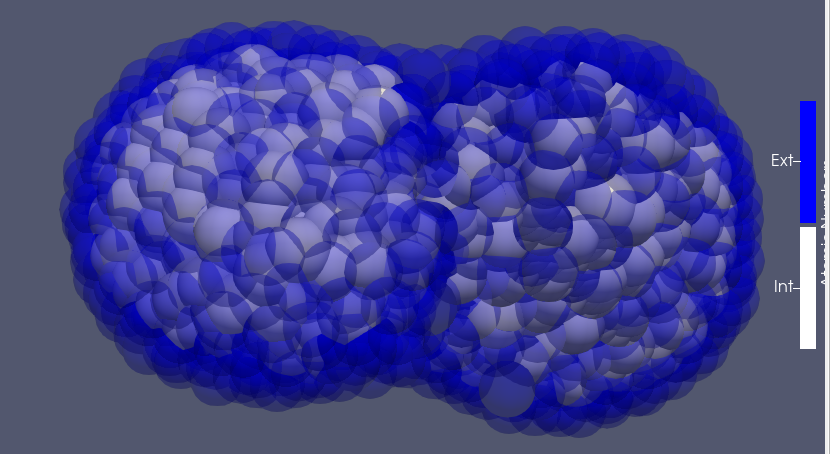

# CellAggregate.jl
A julia implementation of some of the parallel agent based
using CUDA for paralleling for Centre Model for Fusing Cell Aggregates.

## Prerequisites
Install the next packages in julia
``` julia
julia $ ]
    add CUDA
    add ProgressMeter
    add DelimitedFiles
    add Plots
    add Images
    add FileIO
```

## Visualization
For a better visualization, its recommended the use of the [ParaView](https://www.paraview.org/) or [VMD](https://www.ks.uiuc.edu/Development/Download/download.cgi?PackageName=VMD) program of the images in the **data** folder or **test** folder. The files are in the **.xyz** format.

## Example
#### Initial Conditions

#### Final Conditions


## Citation
Pending

## Licence
Pending