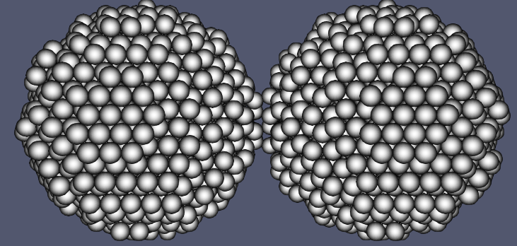
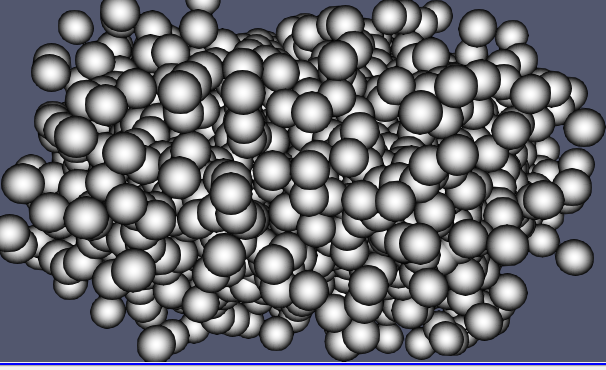

# Centre Model for Fusing Cell Aggregates

A julia implementation of some of the parallel agent based
using CUDA for paralleling.

## Prerequisites

PENDING

## Visualization
For a better visualization, its recommended the use of the [ParaView](https://www.paraview.org/) program of the images in the **data** folder. The files are in the **.vtk** format.

#### Initial Conditions

#### Final Conditions
