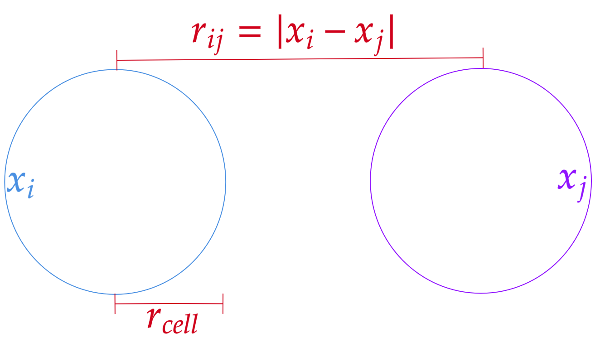

# Introducción

Aunque ha habido avances clínicos alrededor
del trasplante, no hay un esquema fuerte con respecto al procedimiento del trasplante y del donador [@molina2018]. A pesar de ser voluntario, en general la negación de donación es un problema de actualidad [@molina2018]. En países como México se tiene que más de 21500 pacientes esperan un órgano [@excelsior2022]. Para el caso de Bogotá se encuentran 1993 personas en lista de espera, donde la red solidaria tuvo que tomar las debidas precauciones teniendo en cuenta lo ocurrido con el CoVid-19 por el riesgo del receptor durante el trasplante [@alcaldiabogota2021]. Para mayo del 2020, los trasplantes realizados en Colombia sumaron 320 de los cuales el 77% provenían de cadáveres y el resto de los donantes vivos (siendo la mayoría los padres para el caso de los menores de edad) [@institutonacionalsalud2022]. Según la Fundación Cardio Infantil, el 20% de los pacientes que requieren un trasplante puede llegar a fallecer esperándolo [@cardioinfantil2021].

La comprensión de los tejidos y órganos hace parte de un dilema de la ontogenia (desarrollo individual de un organismo), como también para el estudio de la ingeniería tisular [@flenner2012]. El objetivo de la ingeniería de tejidos es el diseño funcional de órganos y células permitiendo la regeneración y sustitución de ciertos órganos [@imani2012].En la actualidad, las investigaciones en ingeniería tisular se han centrado en el estudio de los scaffold (andamios de crecimiento de los agregados celulares) como base estructural de la organización de las células de manera aislada de un tejido [@imani2012]. A partir de la ontogenia se sugiere que no se debería imitar la estructura de los tejidos, sino que se deberían emular microentornos para crear tejidos que fomenten las interacciones complejas entre las células y la matriz adyacente [@mironov2009]. Lo anterior genera un aspecto más biomimético para la simulación de ciertos aspectos de la remodelación de ciertos tejidos [@imani2012]. En diferentes grupos de investigación se están buscando soluciones a la escasez de órganos a partir de diferentes enfoques como los xenotransplantes (órganos animales) o también la ingeniería regenerativa [@boland2003]. 

La xenotransplantación tiene buen enfoque si se tienen en cuenta los animales transgénicos con capacidad reducida a una respuesta inmune, aunque hay una opción de propagación de virus animales [@boland2003].

Uno de los patrones más ampliamente estudiados para la formación de organelos es por la interacción de la afinidad celular diferencial [@jakab-damon2008]. El DAH trata a los tejidos como fluidos con cierta adhesión que se reorganiza buscando su mínima energía libre interfacial [@steinberg2007]. Esta hipótesis fue propuesta por Steinberg y valida numerosos signos moleculares controlando esta afinidad [@steinberg2007]. Esta hipótesis puede ser comprobada a partir de las tensiones superficiales presentes en los tejidos [@steinberg2007].

Los tejidos artificiales en teoría deberían eliminar el problema que existe con la biocompatibilidad que es una propiedad crucial para cualquier enfoque en la formación de agregados u órganos [@mironov2009]. Lo anterior es crucial debido a la carencia de métodos en ingeniería tisular, los órganos solo se podrían producir a partir de procesos embrionarios de manera natural [@mironov2009]. En la actualidad no se conoce el alcance de la ingeniería tisular para ser capaz de la imitación de los diferentes tejidos a partir de la histogénesis, morfogénesis y organogénesis [@mironov2009]. La aproximación más cercana que se tiene es la construcción de ciertos tejidos vascularizados, aunque este enfoque sigue siendo un trabajo en curso. Para lograr lo anteriormente dicho se han propuesto procesos como el autoensamblaje a partir de la generación de ciertas estructuras a diferentes escalas espaciales [@jakab-neagu2004]. Procesos como la histogénesis y organogénesis son ejemplos de autoensamblaje que a través de la interrelación entre las células y la interacción de la célula con su medio [@jakab-neagu2004]. Debido a ciertas limitaciones intrínsecas y económicas en la producción tisular, se puede pensar que la tecnología actual todavía no es capaz de imitar un órgano humano vivo 100% autentico [@mironov2009].

Actualmente se tienen técnicas emergentes basadas en la bioimpresión mediante la disposición de agregados "capa por capa" como biotinta, generando una fusión posterior a la bioimpresión para la construcción del tejido deseado [@flenner2012]. Para poder usar la bioimpresora se requiere de la manipulación de ciertos "bloques de construcción", los cuales son células propias de cierto organismo combinado con una matriz de soporte [@sego2017]. Por razones biológicas, los agregados celulares tienen forma esférica denominados esferoides celulares siendo impulsados por las mismas células [@sego2017]. Las técnicas actuales pueden llegar a ser costosas por el material usado y los equipos personalizados para este proceso [@maritan2017]. Adicional a lo anterior, los esferoides abarcan una gran cantidad de tamaños y formas que generan una dificultad para la comparación de las condiciones de crecimiento [@maritan2017].

Para diferentes agregados celulares no se tienen suficientes experimentaciones para poder ser comparados. Usualmente, los modelos computacionales usados actualmente para sistemas multicelulares se limitan a la interpretación de procesos morfogénicos de formas específicas [@flenner2012]. Existen modelos a partir de la representación por elementos viscoelásticos, modelos por "spins" adyacentes a partir de la discretización del espacio como el **Cellular Potts** para clasificación celular o también métodos *Off-Lattice* a partir del centro de masa de esferas. Autores como Broadland han sugerido modelos a partir de elementos finitos modelando fuerzas y dinámicas presentes en sistemas multicelulares [@flenner2012]. En la actualidad se tiene un acuerdo entre lo experimental y lo teórico de que el equilibrio entre la adhesión de las células y la tensión cortical (tensión entre las membranas de las células) determina la morfología celular, lo anterior define un sistema a partir de la dinámica de los agregados y la morfogénesis de los tejidos [@thomas2014]. A partir de lo anterior se puede deducir que se requiere de un framework con el cual se puedan obtener datos de calibración de ciertos agregados celulares para poder tener los datos disponibles para poder llegar a simular diferentes geometrías de los diferentes agregados celulares para poder ser usados en diferentes topologías presentes en los diferentes tejidos o constructos celulares.

# Marco teórico

## Bioimpresora 3D

La bioimpresión se basa en la disposición precisa capa por capa (layer-by-layer) del agente biológico y/o agregados celulares. Esta técnica está basada en técnicas biomiméticas nombradas anteriormente con el potencial de superar los limitantes presentes con el uso de scaffold sólido. El uso de la bioimpresora requiere del uso de gotas esféricas que puedan ser almacenadas en un cartucho de la impresora [@imani2012]. Esta técnica ofrece ciertas ventajas como: mejoramiento del tiempo de supervivencia de las células y el uso de una densidad celular más alto. Para el caso de las bioimpresoras existen casos en donde se requiera la impresión de más para estructuras más complejas que lo requieran [@jakab-damon2006].

Actualmente existen distintos métodos experimentales para la fabricación de estructuras complejas, entro los métodos se encuentra la extrusión, teolitografía, impresión asistida por láser, entre otros. Este tipo de métodos presenta cierto tipo de inconvenientes con respecto a la precisión, resolución y la velocidad de producción. Los procesos actuales usan hidrogeles blandos como portador de la célula o fármaco, donde los biopolímeros más usados son: la poli caprolactona, ácido poli láctico, ácido hialurónico, polietilenglicol y compuestos inorgánicos como lo son el fosfato de calcio [@shanjani2015].

El procedimiento de la formación de las estructuras a partir de bioimpresora se realiza de la siguiente manera:

* **Preprocesamiento**: Preparación de la biotinta
* **Procesamiento**: Entrega automatizada de los agregados celulares con cierta matriz extracelular.
* **Postprocesamiento**: Incubación de los constructos celulares bajo ciertas condiciones de maduración.

Una de las características distintivas con la impresión reside en que la impresión 3D solo suministra un material inerte mientras que la bioimpresión después del procesamiento requiere de un proceso adicional de maduración. El proceso de maduración puede llegar a ser controlado a partir de ciertas estimulaciones mecánicas con ciertos tipos de biorreactores. La cuantificación de la bioimpresión es complicada y no es raro que los encargados de usar las bioimpresoras tengan que recurrir a un enfoque basado en la prueba y error [@shanjani2015].

Entre las principales limitantes que restringen a la impresión se debe al estado de la gelificación del hidrogel usado. Una gelificación no homogénea dificulta mejorar la precisión de ciertos tejidos en donde se requiere una estructura con pocas capas. Otra limitación es la construcción de ciertos tubos ramificados a partir de esferoides grandes y los espacios vacíos entre esferoides impresos [@jakab-norotte2010]. Aunque el proceso de impresión a partir de extrusión mecánica es el más usado, hay investigaciones recientes con otros tipos de disposición de las células. Uno de los métodos es la funcionalización magnética de la matriz extracelular permitiendo el desarrollo de biofabricaciones impulsado a partir de la levitación magnética [@koudan2016]. En la actualidad los sistemas requieren una mejor integración de componentes multifuncionales blandos y duros [@shanjani2015]. Para el caso de impresión de láminas celulares, se tiene que pueden llegar a ser ideales para la impresión de piel dañada. Lo anterior se logra a partir la preparación de ciertos agregados con un diámetro comparable al grosor del injerto deseado [@jakab-norotte2010].

## Biotinta

A partir de la formación de los agregados celulares se tiene la ventaja de una correcta disposición fisiológica de ciertos tejidos a partir de los contactos adhesivos con los vecinos celulares. Para una correcta formulación de biotintas, se requiere conocer la interacción entre las células como también el uso óptimo de ciertos hidrogeles junto al tipo de célula usado. Las biotintas son críticos para la biofabricación de los órganos por poseer ciertos parámetros reológicos. Para poder realizar el proceso de impresión se requiere del ambiente óptimo para el desarrollo, motilidad y actividad metabólica de las células [@levato2014].

La formación de los agregados celulares a partir de hidrogeles plantea varios desafíos: uno de ellos es utilizar hidrogeles altamente hidrofílicos en donde los agregados seas limitados a una forma esférica independiente de la morfología nativa de la célula; otro desafío es la impresión de tejido grande lo cual requiere la encapsulación de una gran cantidad de células que es difícil de obtener de un injerto. Por lo anterior se deben usar estrategias para mejorar las propiedades mecánicas y bioquímicas de los bioenlaces del biomaterial con las células para lograr una óptima construcción de tejidos funcionales [@levato2014]. La óptima construcción del tejido también depende de la naturaleza de la fusión de los agregados (siendo aplicable a líquidos altamente viscosos) [@shafiee2015]. Sin embargo, el uso de biotintas no es general para todo tipo de tejidos. 

Esta reconstrucción de tejidos requiere de ciertos scaffold con respecto a la cierta propiedad que se requiera [@shanjani2015]: Para el caso de materiales estructurales como huesos, se requiere una integridad estructural y mecánica. Para el caso de ambientes blandos, se requiere el uso de ciertos hidrogeles blandos para permitir la difusión de ciertos bioagentes (como señales bioquímicas y metabólicas). Estos hidrogeles proporcionan un ambiente adecuado para que los agregados cumplan con sus funciones celulares como lo son la adhesión, motilidad, crecimiento y diferenciación si se requiere.

Por lo anterior, la rigidez para ciertos andamios rígidos debe ser similar a tejidos duros como el hueso esponjoso poroso, mientras que la propiedad más importante para los hidrogeles blandos es el módulo elástico similar a tejidos como lo son el cartílago, músculo y vasos sanguíneos [@shanjani2015].

En el contexto de lograr un biomimético a partir de la interacción de los agregados celulares y la matriz extracelular, se debe ayudar a las células a diferenciarse o fusionarse de la manera óptima. Por consiguiente, estos entornos deben proporcionar ciertos factores moleculares, biológicos y físicos que optimicen el potencial de la regeneración de los tejidos. Se pueden usar células mesenquimales humanas que pueden llegar a formar ciertos tipos de tejidos (como lo pueden ser vasos sanguíneos, cartílago, hueso, entre otros), pero no se pueden formar necesariamente músculos, nervios o hepatocitos. Hay investigaciones recientes a partir de células iPS procedente de ciertos tejidos humanos, con los cuales se puede llegar a formar ciertas células similares a la embrionarias para la regeneración de ciertos tejidos cardiacos. La técnica mencionada requiere de una modificación genética de estas células en un futuro [@jakab-norotte2010].

## Agregado Celular

El uso de bioimpresoras 3D depende de los organismos vivos usados para la formación de los tejidos, por ello se requiere el uso de ciertos agregados celulares generalmente producidos como esferoides. En comparación con monocultivos se tiene que los esferoides se auto ensamblan a partir de ciertas interacciones celulares naturales imitando patrones de diferenciación presentes en entornos naturales, como también interacciones de las células con la matriz extracelular [@imani2012]. A partir de la experimentación se ha visto que, si la interacción entre las células es lo suficientemente alta, entonces se van a formar los agregados deseados [@boland2003]. Hay casos en donde ciertas células que generan una matriz extracelular adicional a la proporcionada, generando que la estructura promueva su autoensamblaje [@boland2003]. Como ejemplo se tiene que los fibroblastos no se adhieren entre sí, sino que su autoensamblaje es a través de su matriz extracelular, donde estas células pueden llegar a ser manipuladas genéticamente para la expresión de ciertas moléculas que promuevan la aglomeración de cieta población de células adyacentes o en otros tipos de células para ayudar a su aglomeración [@robu2019].

Para entender la base molecular de la agregación celular se sabe que cuando una población celular se diferencia, estas se pueden polarizar a partir de ciertas moléculas de adhesión a partir de cierta expresión genética que solo se expresa en partes restringida de las membranas de las células. En consecuencia, esto genera la minimización de la energía conformacional a partir de cierta fuerza motriz de la reorganización celular [@jakab-norotte2008].

La capacidad de los esferoides para lograr la fusión se sustenta a partir de conceptos de fluidez tisular, donde los tejidos embrionarios se consideran como líquidos muy viscosos. Específicamente los esferoides se redondean en forma esférica similar a una gota de líquido en suspensión o en superficies no adhesivas. Es importante saber que los agregados celulares deben ser lo suficientemente pequeños para permitir la supervivencia de las células en el centro del agregado [@boland2003].

Para la producción de agregados celulares se deben tener en consideración ciertos conceptos físicos como la transferencia de masa y los esfuerzos cortantes entre las células. Para el caso de la transferencia de masa se tiene en cuenta la difusión de los diferentes sustratos y químicos que hacen parte del metabolismo de las células. También se deben tomar en cuenta los esfuerzos cortantes como generador de la interacción y adhesión de las células para su autoensamblaje. En la literatura hay información y datos de la aparición de necrosis en los esferoides por el crecimiento del mismo esferoide [@decarli2021]. La reducción del tamaño de los agregados es resultado de interacciones célula-célula más fuertes que genera una estructura compacta y el aumento de este puede ser debido también por necrosis en ciertas zonas del agregado [@imani2012]. Para el uso de agregados celulares en 3D se debe tener en cuenta que estos tipos de cultivos producen cierta morfología distintiva y ciertos eventos de señalización dependiendo de las células usadas, donde lo anterior en contraste con cultivos bidimensionales, son diferentes [@imani2012].

Actualmente, el modelo para la fusión de agregados son las células ser la línea celular de mamíferos industrial más importante, de manera similar a la Escherichia Coli para las bacterias y la Saccharomyces Cerevisiae para las levaduras. Se usa las células de CHO por las siguientes razones[@omasa2010]:

* Existen buenas normas de fabricación (GMP) certificadas para CHO y las normas de seguridad para estas células están claramente definidas.
* Los medios industriales sin suero están desarrollados y su adaptación es fácil
* La producción de líneas celulares de CHO está bien estudiada.
* Se han desarrollado cultivos con alta densidad en ciertos lotes a gran escala y su tecnología de escalado es bien establecida.

Además de formar tejidos con los agregados celulares, los esferoides se investigan para la producción de órganos o también la prueba de medicamentos a partir de diferentes cultivos celulares. Con respecto a los cultivos celulares, se tiene que las investigaciones más recientes se realizan para la construcción de tejidos vasculares a partir de tubos lisos que envuelven cilindros de agarosa, usándose para evitar el deterioro de los lúmenes (espacio interior de una estructura tubular de cierta arteria o intestino) [@robu2019]. En ciertos esferoides compuestos por células de diferente origen (endoteliales, fibroblastos y células madre mesenquimales) se pueden generar estructuras vascularizadas similares permitiendo la construcción de segmentos vasculares ramificados que pueden ir desde pequeñas arterias hasta capilares [@robu2019].

## DAH (hipótesis de adhesión diferencial) y Fusión de Esferoides

La fusión de los esferoides es esencial para la formación de los tejidos a partir de las bioimpresoras 3D donde este proceso está presente durante el proceso embrionario. La fusión de los tejidos es un fenómeno físico impulsado por fuerzas de tensión superficial de las células sustentado a partir de la "hipótesis de adhesión diferencial" propuesta por Malcolm Steinberg [@steinberg2007].

Según Steinberg, la formación de estructuras se produce por [@steinberg2007]:

* La diferencia de adhesión célula-célula entre los diferentes tipos de células existentes en el modelo.
* La motilidad celular: las células buscan la configuración espacial en donde se tengan enlaces fuertes como puede ser en la mezcla de dos tipos de células de diferente cohesividad generando que las células menos cohesivas se separen y ocupen la región central rodeada por la población menos cohesiva (como ocurre con dos gotas de fluidos inmiscibles).

Steinberg introdujo el concepto de tensión superficial tisular como un valor cuantitativo para poder llegar a clasificar los agregados celulares [@steinberg2007]. La tensión superficial tisular está dada por la relación de la adhesión celular y tensión entre las células en el agregado [@flenner2012].

A partir de lo anterior se puede ver que los tejidos son tomados como líquidos viscoelásticos cuya tensión es medible. Los experimentos in vitro han mostrado que la tensión superficial entre células está bien definida con lo cual se puede llegar a caracterizar los agregados celulares [@robu2019].

## Simulación de Fenómenos Biológicos

Aunque el uso de agregados celulares para la formación de tejidos es el proceso más investigado para la producción de órganos en los últimos años, el uso de estos esferoides es costoso. Lo anterior ocurre por el uso adecuado de tipo celular, sensibilización a los factores específicos para cada tipo de célula, producción de esferoides a gran escala y las condiciones adecuadas de impresión. A partir de lo anterior varios autores usan el modelamiento para la predicción de la evolución de la impresión [@robu2019].

Lo anterior ha intensificado la necesidad del uso de modelos computacionales multifocal de manera eficaz para poder entender los fenómenos presentes a diferentes escalas temporales y espaciales. La modelación de estos tipos de células tiene como finalidad la identificación de las condiciones para la explicación de ciertos comportamientos complejos como lo puede ser la homeostasis, aparición de estados patológicos, modelado de medicamentos y prueba de medicamentos en ciertos tipos celulares [@maspero2019]. Para lograr la simulación se han propuestos modelos biofísicamente aceptables para la interacción entre las células. Generalmente el estudio de la interacción de las células en la escala temporal y espacial de ciertos tipos de células en ambientes heterogéneos puede llegar a ayudar el estudio de ciertas técnicas actuales de una manera más eficiente [@maspero2019]. Aunque el uso de simulaciones es un factor de favorecer la investigación, para este caso se debe garantizar la correcta simulación de los tejidos a partir de los datos necesarios para la fusión de los agregados. Lo anterior es importante para verificar que en la fusión no haya falla en el consumo de oxígeno y nutrientes [@robu2019].

# Fusión de Esferoides y Tiempo de Fusión

El tiempo de adhesión es un parámetro que se debe tener en cuenta para la determinación de la velocidad de impresión de las diferentes capas sucesivas [@boland2003]. De la fusión de esferoides se sabe experimentalmente que durante el proceso los tejidos blandos esféricos se comportan como dos gotas de fluidos viscoelásticos fusionándose, cuya descripción requiere de una modelación hidrodinámica a priori. No obstante, la simplicidad de la geometría de la fusión no permite una descripción del proceso de la fusión a partir de la conservación de masa presente en la fusión de dos gotas viscosas [@flenner2012].

![Esquema de la fusión de dos esferoides con el mismo diámetro [@oriola2022]](img/3.png){width=220}

Una forma conveniente de la descripción se puede representar de la siguiente manera:

\begin{equation}
    (r/R_o)^{2}=sin^{2}\theta=1-exp(-t/\tau)
    \label{eq:radius_evolutiuon_time}
\end{equation} 

A partir de este enfoque, la fusión de diferentes agregados celulares con distinto origen puede determinarse a partir de un tiempo característico ($\tau$) para poder calibrar la fusión real con el tiempo generado en el modelo [@flenner2012].

Aun así, hay autores como David Oriola [@oriola2022] han realizado la simulación del cambio del ángulo entre las esferas a partir de la suposición de la consideración de los esferoides como un material Kelvin-Voigt incompresible, que puede llegar a ser caracterizado a partir de la viscosidad ($\eta$), módulo de cizalla ($\mu$) y la tensión superficial ($\gamma$). Este modelo fue usado por representar de manera efectiva ciertos modelos con tejidos y esferoides celulares. A partir de ciertas aproximaciones de la ecuación constitutiva del tensor del tensor de esfuerzos, se halla la siguiente ecuación que representa la dinámica de la fusión:

\begin{equation}
    \theta=2\cdot\frac{cot(\theta)}{\tau}(R_o/R_{\theta})^3\cdot[f(\theta)-\beta\cdot{g(\theta)}]
    \label{eq:tensor_radius_evolutiuon_time}
\end{equation} 

<!-- Donde τ = ηRo/γ siendo el tiempo de la viscoelasticidad característico y β = μRo/γ siendo el parámetro
adimensional que caracteriza el grado de fusión de las esferas. Y finalmente las funciones f(θ) y g(θ) son: -->

Donde $\tau=\eta*R_{o}/\gamma$ siendo el tiempo de la viscoelasticidad característico y $\beta=\mu*R_o/\gamma$ siendo el parámetro adimensional que caracteriza el grado de fusión de las esferas. Y finalmente las funciones $f(\theta)$ y $g(\theta)$ son:

\begin{equation}
    f( \theta ) =\frac{4}{1+cos( \theta )}
    \label{eq:tensor_radius_evolutiuon_time_1}
\end{equation} 

\begin{equation}
    g( \theta ) =\frac{2}{cos( \theta ) \cdotp ( 1+cos( \theta ))} \cdotp \left[\frac{2\cdotp R_{o} \cdotp ( 1+\varepsilon _{\gamma })}{R( \theta ) \cdotp ( 1+cos( \theta ))} -1\right]
    \label{eq:tensor_radius_evolutiuon_time_2}
\end{equation} 

Para el caso de $\beta=0$, la ecuación de la dinámica de la fusión se reduce a la expresión de la sinterización de gotas viscosas. Si se asume $\beta$ como como un parámetro de bifurcación se halla que $\beta > \beta_{x} = 1/\varepsilon_{Y}$ con valores finales de $\theta=0$ (cuando no hay fusión de esferas). Aun así, para $\beta<\beta_{c}$ , el sistema genera un estado inestable en $\theta=0$ generando la fusión de los agregados [@oriola2022]. Para regímenes de baja coalescencia y a un ángulo ($\theta_{max}$), tienen una baja correlación con $\varepsilon_{Y}$ (grandes cambios de $\varepsilon_{Y}$ se acompañan con pequeños cambios en $\beta$). A partir de las experimentaciones dadas en [@oriola2022], se asume por simplicidad que $\varepsilon_{Y}=0$.

## Modelos de simulación de la fusión de esferoides

Distintos autores han formulado modelos computacionales como herramienta para la fusión. El desarrollo de la fenomenología y la exploración de parámetros característicos requiere de un contexto eficiente. Para la comprensión de los tejidos se han usado ciertos modelos computacionales basados generalmente en dos tipos de modelos:

1. **On-lattice**: Son modelos que asumen el espacio de simulación como una aproximación discreta del espacio. Aproximan el espacio de fusión de las células a pixeles. Son modelos muy dependientes de la malla usada para la simulación. Usualmente los modelos On-Lattice usan modelos estocásticos para poder evaluar la evolución del sistema y u cuántica) para la identificación de las células o compuestos químicos presentes en los límites de la simulación. Entre los modelos más conocidos están el Cellular Autómata y el Cellular Potts. Para el caso del Cellular Potts se tiene que fue un modelo muy usado en las dos últimas décadas para la simulación de tejidos mesenquimales a partir de la descripción de la adhesión celular.

2. **Off-Lattice**: Son modelos asumiendo una distribución continua de la célula en el espacio. Se usan diferentes aproximaciones físicas para interpretar el comportamiento de las células como lo son la aproximación a esferas viscoelásticas, fluidos muy viscosos a bajos números de Reynold, asumiendo sólidos en difusión a partir de la difusión de Turing, asumir superpuestas, entre otros. Normalmente estos modelos asumen aproximaciones de fenómenos físicos que se aproximen a la naturaleza de la fusión de los agregados celulares. Para el caso de las esferas superpuestas se asume la $3^{ra}$ ley de Newton (Principio de Acción Reacción) para modelar las interacciones de las células en el agregado celular.

Se puede ver que a inicios de la década pasada se estaban usando modelos discretos (principalmente Cellular Potts) para el desarrollo de entornos de simulación basados en la discretización del espacio como en el caso de Parallelelized Cellular Potts o ASMC3D para la simulación de tejidos y formación de tejidos por haptotaxis o quimiotaxis. [@germann2019]. Para el caso de la segunda mitad de la década pasada se puede ver que se han desarrollado más modelos continuos basados en modelos Vertex (basado en simular las membranas de las células como polígonos irregulares). Aunque los modelos continuos tengan una aproximación más real, estos modelos tienden a requerir una capacidad computacional muy alta. Por lo anteriormente dicho, se han sugerido modelos intermedios como lo son las Esferas superpuestas que solo toman el centro de masa de cada célula para el cálculo y asume las leyes de newton para su dinámica [@mathias2020].

Autores como [@mathias2020] han desarrollado un framework para la comparación de diferentes interacciones entre células para comparar las que generen una mejor aproximación usando diferentes herramientas numéricas para la solución de las ecuaciones diferenciales presentes en el sistema. Otros modelos (con su respectivo Framework) usados se presentan en la Tabla 1 a partir de modelos Discretos
(On-Lattice) o Continuos (Off-Lattice).

**Tabla 1 Pendiente**

Para una mejor ejemplificación se van a explicar dos modelos: el discreto (Cellular Potts) que es el mas usado
en los casos discretos y el continuo (esferas sobrepuestas) que se está empezando a usar en los dos últimos
años para la modelación de agregados celulares.

## Modelo de Cellular Potts

El modelo de Cellular Potts (CPM) es un modelo muy usado por su versatilidad. El modelo (también llamado modelo de Glazier-Graner-Hogeweg) es un modelo computacional usado para células y tejidos a partir de sus interacciones individuales y colectivas. En esa época, se relacionó la mezcla de agregados celulares heterogéneos concluyendo que se clasificaban en parches celulares de manera espontánea. Para entender lo anterior, Graner & Glazier se propusieron modelar este fenómeno basado en la "hipótesis de adhesión diferencial". El modelo propuesto por Graner y Glazier es basado en el modelo Potts usado inicialmente en física para la simulación de los imanes (donde este modelo emula la interacción entre diferentes compuestos químicos con cierto spin que es análogo al spin de las partículas cuánticas) en una red cristalina [@flenner2012].

El modelo se basa en una representación matricial del espacio donde cada pixel representa un espacio de las células o la matriz extracelular en un sistema multicelular a partir del spin, donde 0 representa la matriz extracelular y los demás números enteros positivos representan los diferentes tipos de células en el sistema. Para describir la interacción entre las células se hace a partir de la energía efectiva (para el caso de CPM se asumen amortiguaciones perfectas y fluctuaciones casi térmicas) para poder simular la evolución continua del sistema para minimizar la energía total del sistema Para el caso de la energía efectiva se tiene que para los casos de haptotaxis y quimiotaxis se modela añadiendo energía potencial química y de crecimiento. En general para poder simular un órgano completo se requiere simular aproximadamente 105 células con tamaño de red similar (Glazier & Popp, 2007).

De manera general, el CPM se realiza de la siguiente manera:
1. Se escoge un pixel discreto en el espacio matricial
2. Se escoge un vecino del pixel escogido
3. Se halla el cambio del hamiltoniano entre los dos pixeles hallados.
4. Se usa el algoritmo de Metrópolis para aceptar o rechazar en el nuevo pixel
5. Se repite el primer paso.

Como se dijo anteriormente, se requiere definir el algoritmo de metrópolis con el cual se evalua el cambio de "spin". Se propone un cambio de "spin" causado por el cambio del hamiltoniano. El cambio del "spin" es aceptado a partir de cierta probabilidad dada por la siguiente ecuación:

\begin{equation}
    P( \Delta H) =\begin{cases}
    1 & \Delta H\leqslant 0\\
    e^{-\Delta H/T} & \Delta H >0
    \end{cases}
    \label{eq:metropolis_equation}
\end{equation} 

Donde T es el valor definido como el parámetro que mide la fluctuación de motilidad del sistema.

A partir de la experimentación se ha determinado que el planteamiento está en consonancia con la hipótesis de adhesión diferencial de Steinberg (DAH), que afirma que las células buscan activamente minimizar la energía libre total de adhesión del sistema multicelular. El mecanismo morfogenético propuesto en este trabajo, la fusión de esferoides celulares está bien caracterizado tanto experimentalmente como teóricamente [@robu2019].

## Modelos "*Off-Lattice*"

Aunque los modelos discretos son muy usados para simulación de la concentración de ciertos compuestos químicos presentes en la dinámica intracelular, se ha visto que los modelos "*Off-Lattice*" o sin discretización del espacio pueden describir la disposición de las células en los agregados de manera más realista. Entre los modelos Off Lattice más conocidos se encuentran [@mathias2020]:

* Modelo de Reacción-Difusión
* Modelo Vertex
* Método de Elementos Subcelulares
* Lattice Boltzmann
* Phase Field
* Esferoides Viscoelásticos

Aunque estos modelos presentan una aproximación al realismo es lo suficientemente aproximada, estos modelos requieren de una capacidad computacional muy alta [@mathias2020]. A partir de lo anterior es importante definir que las generalizaciones de los modelos de "*Off-Lattice*" [@nava-sedeño2020]:

• Se representa cada célula o partícula a partir de un punto en el espacio que se mueve con velocidad constante a partir de un vector unitario $(\nu \in R^{d})$

• La partícula solo interacciona con sus vecinos circulares con radio $R(B_{R}(X_{M}))$

• La interacción entre las partículas es modelada a partir de un potencial ($U_M$), donde la partícula de las células es modelada a partir de las leyes de movimiento de Newton.

Por la dificultad de la capacidad computacional, se ha planteado modelos simplificados de modelos "*Off-Lattice*"

### Modelo "*Off-lattice*" basado en el Centro de Masa

Los modelos *Off-Lattice* (CBM) se basan en el seguimiento del centro de masa de cada partícula a partir de las interacciones mecánicas presentes entre las células. Aunque existen otros modelos basados en el centro de masa como lo son los modelos **Vertex** que requiere el cálculo de la tensión interfacial y presión de las células [@mathias2020]. Para el caso del modelo basado en el centro de masa, se logra una relación equilibrada con respecto a la eficiencia numérica y la capacidad de incorporación de modelos contínuos de la mecánica celular presente en la agragación de las células teniendo en cuenta aspectos importantes como lo son la temporalidad del sistema a partir de la biofísica del sistema [@mathias2020].

Para el caso del modelo *Off-Lattice* (CBM) se han propuesto diferentes modelos físicos a partir de la interacción entre las células para proporcionar descripciones del sistema con modelos parecidos a Lattice Boltzmann como lo son el modelo *Johnson-Keller-Roberts*.

De manera general, para los diferentes modelos *Off-lattice* se usa la tercera ley de Newton, donde:

\begin{equation} 
    m_i*a=m_i*\ddot{x}_i=F_i \label{eq:third_newton}
\end{equation} 

A partir de la suma de las fuerzas en cada célula se halla la siguiente ecuación:

\begin{equation}
    m_i*\ddot{x}_i=-\nabla*\dot{x}_i+\sum_{j \neq i}{F_{ij}} \label{eq:sum_third_newton}
\end{equation} 

Para la simulación se usa la siguiente ecuación simplificada, donde:

\begin{equation}
    \lambda*\sum_{j}{\dot{x}_i-\dot{x}_j}=\sum_{j}{F^{S}_{ij}+F^{a}_{ij}} \label{eq:sum_forces} 
\end{equation} 

Donde para el caso presentado se tienen las  fuerzas repulsivas ($F^{S}_{ij}$) & fuerzas atractivas ($F^{a}_{ij}$).

El sistema representado a partir del centro de masa puede ser representado de la siguiente manera:

![Ilustración del modelo de centro de masa. Se asume fuerzas de atracción y repulsión [@mathias2020]](img/1.png){width=220}

Para calcular la evolución temporal, normalmente se usa el método de Euler hacia delante ("*foward Euler method*"):

\begin{equation} 
    y_{n+1}=y_n+\Delta t*f(t_n,y_n) \label{eq:foward_euler_method}
\end{equation} 

Aunque actualmente se han usado métodos con varios pasos teniendo en cuenta valores pasados. Entre los métodos más usados se encuentra el método de Adams-Bashforth, donde:

\begin{equation} 
    y_{n+1}=y_n+\frac{3}{2}*\Delta t*f(t_n,y_n)-\frac{1}{2}*\Delta t*f(t_{n-1}, y_{n-1}) \label{eq:adam_bashforth_equation}
\end{equation} 

Para la simulación es este tipo de sistemas se tiene software generado como lo puede ser *Ya||a* [@germann2019] que usa el lenguage de progrmamación CUDA usando GPU (tarjetas gráficas) permitiendo su paralelizacióñ en cada paso de Euler en un proceso similar hallado en la paralelización en los modelos de Cellular Potts [@tapia2011].

## Modelos de fuerzas características de la interacción celular

{width=220}

En los últimos años se han desarrollado y usado diferentes interacciones con los cuales se han modelado la interacción entre las celulas presentes en el agregado celular, entre los modelos mas usados se tiene los siguientes:

### Modelo Cúbico
Este modelo fue desarrollado por [@delile2017]. En este modelo se asume la relación entre las células como fuerzas cúbicas par ale caso de las fuerzas atractivas y las fuerzas de resorte lineal como la interacción de repulsión. Este modelo ha sido usado en un framework llamado *MecaGen*. Las interacciones son las siguientes:

\begin{equation} 
    F^{Cubic}( r) =\left
    \{\begin{matrix}
        \mu \cdotp ( r-r_{max})^{2} \cdotp *( r-r_{min})\\
        si\ r \leqslant r_{max}\\
        \\\\
        0\\
        si\ r_{max} < r
    \end{matrix}\right. 
    \label{eq:mecagen_eq}
\end{equation} 

### Modelo Lineal Generalizado de resorte
Este modelo fue desarrollado por [@cooper2020]. Este modelo usaba la suma de polinómios para la representación de la atracción y repulsión. El modelo ha sido usado en el software llamado "*Chaste*" usado para el estudio del cáncer. Las interacciones se representan con la siguinete ecuación, donde:

\begin{equation}
    F^{GLS}( r) =\left
        \{\begin{matrix}
        \mu \cdotp log( 1+( r-r_{min}))\\
        si\ r\leqslant r_{min}\\
        \\\\
        \mu \cdotp ( r-r_{min}) \cdotp exp( -\alpha ( r-r_{min}))\\
        si\ r_{min} < r\leqslant r_{max}\\
        \\\\
        0\\
        si\ r  >r_{max}
    \end{matrix}\right.
    \label{eq:GLS_eq}
\end{equation}

Para los dos modelos mencionados anteriormente se tiene que **$\mu$** es el parámetro que representa la relación de atracción & repulsión de las células, **$r_{min}$** es la distancia mínima entre las células donde se inicia la repulsión de las células en los agregados, **$r_{max}$** es la distancia máxima donde no hay interacción de atracción del medio presente entre las células & **$s$** es un factor que determina el ancho de la 
fuerza que es dependiente de **$r_{max}$**.

# Metodología

Para poder realizar las simulaciones, el modelo basado en el centro de masa fue programado en [Julia](https://julialang.org/) usando un *wrapper* dentro del lenguage [CUDA](https://developer.nvidia.com/cuda-downloads) usado como lenguaje para computación en paralelo creado por Nvidia&reg;. El software usado para esta tésis se llama [CellAggregate.jl](https://github.com/NicoMosty/CellAggregate.jl). La búsqueda de vecinos cercanos de cada célula se realiza a partir de una versión modificada del algoritmo de vecinos cercanos [kNN](https://www.ibm.com/co-es/topics/knn) a partir de la programación paralela del mismo método en CUDA, el algoritmo se presenta en \ref{alg:kNN}. Para el cálculo de las fuerzas que interaccionan en cada célula se usa un calculo paralelizado a partir de los vecinos hallados con kNN. La ecuación de movimiento (\ref{eq:sum_forces}) fue resuelta con el método Leapfrog. 

\begin{algorithm}
    \caption{kNN algorithm for parallel computing}
    \label{alg:kNN}
    \DontPrintSemicolon
    \SetAlgoLined

    \KwResult{Devuelve una matriz con los índices de las esferas más cercanas (nn) a cada esfera en el agregado}
    \SetKwInOut{Input}{Input}\SetKwInOut{Output}{Output}

    \Input{X(x,y,z), nn$\longleftarrow$number of nearest neighbors}
    \Output{Matrix[nn,size(X)]}
    \BlankLine
    \Begin{
        \emph{Variables Iniciales}\;
        $Size \longleftarrow Size(X)$ ;
        \BlankLine
        
        \emph{Defining Coordinates of each cell on the aggregates}\;
        $i_{Cell} = repeat(X,Size) - traspose(repeat(X,Size))$;
        \BlankLine
        
        \emph{Calculating Norm on every cell on the aggregate}
        \BlankLine
        $Dist = sqrt.(i_{Cell}.^{2})$

        \emph{Calculating index of knof each cell in the aggregate}
        \BlankLine
        \For{i=1:nn}{
            $idx[i,:]=findmin(Dist; dims=1)[2]$
            \BlankLine
            $Dist[idx[i,:]] .= Inf$
        }
    }
\end{algorithm} 

## Algoritmo Leapfrog

<!-- Despite the Kelvin–Voigt model providing a good fit to theexperimental data, the rheology of cell aggregates is indeedmuch more complicated and it is unclear how cell–cell inter-actions give rise to the observed effective macroscopic mechan-ical properties. To understand this, we turned to agent-basedsimulations of cellular aggregates using the GPU-based soft-ware ya8a (see Fig. 4A), which supports easy implementation ofdiverse cellular behaviours.51For simplicity, we considered aminimal model taking into account passive and active inter-actions between cells, similarly to other agent-based modelsdescribing multicellular aggregates.31,47,52,53The dynamics of a --> -->

# Bibliografia
\footnotesize
